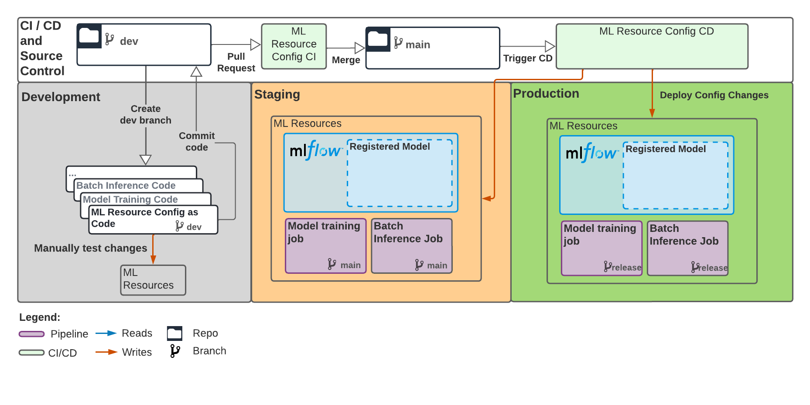

# Databricks ML resource config
This directory includes Databricks ML resource configuration, i.e. the definitions of a batch
inference job, a training job, an MLflow experiment, and an MLflow model.
Configurations are split into separate `staging` and `prod` subdirectories
for separate environments (separate staging/prod Databricks workspaces), and are expressed in
the [Terraform language](https://www.terraform.io/language#terraform-language-documentation).

Managed configs are not defined for dev, but you can manually test changes to staging/prod configs by
creating identical resources in dev and verifying their behavior.

This project ships with CI/CD workflows for developing and deploying ML resource config. You can open a PR (pull request) to modify configs in staging and prod,
which will be unit-tested and then deployed after the PR is merged:



## Prerequisites

### Configure remote state storage
To enable usage of the config interface, you or your ops team must first resolve the
TODOs in `staging/provider.tf` and `prod/provider.tf`, configuring
a [remote terraform backend](https://www.terraform.io/language/settings/backends) for storing the state of
deployed resources. See the `provider.tf` files for an example of configuring remote
state storage with
 S3 .

After specifying remote backends in `provider.tf` files, you can locally verify that the backend configuration
is valid and that you're able to access remote state:

1. Follow remote backend docs to set up authentication on your local machine
(e.g. if using the [s3 backend](https://www.terraform.io/language/settings/backends/s3), ensure you can access the S3
bucket where state is stored from your local machine, for example by configuring the [AWS CLI](https://docs.aws.amazon.com/cli/latest/userguide/cli-configure-quickstart.html)).
2. Set the `DATABRICKS_HOST` environment variable to your staging workspace URL and `DATABRICKS_TOKEN` to
   a Databricks REST API token for your staging workspace.
3. From the `databricks-config` directory, run `terraform -chdir=staging init && terraform -chdir=staging plan`
   (supply dummy values for variables when prompted) to verify that you're able to authenticate to the remote backend.

**Note:** If using the Terraform Cloud backend, make sure your Terraform workspace is configured
to [execute plans locally](https://www.terraform.io/cloud-docs/workspaces/settings#execution-mode).
Authentication to Databricks REST APIs will not work if plans are executed remotely.

### Configure CI/CD
If you haven't already, configure CI/CD to use the necessary credentials to read and update Terraform state.
See [.github/workflows/README.md](../.github/workflows/README.md#configure-secrets-for-ml-resource-cicd) for more details.

## Deploy initial ML resources
After completing the prerequisites, you can deploy an initial set of ML resources
by merging a PR adding the latest contents of `databricks-config`. See
the [Develop and test config changes](#develop-and-test-config-changes) and [Deploy config changes](#deploy-config-changes)
sections below for details.

The ``databricks-config`` directory contains additional TODOs for setting user-defined parameters,
e.g. the input and output table names for batch inference. Ignore these TODOs for now and proceed 
with merging a PR to deploy the initial ML resources. Then, follow the next section to configure 
and deploy the batch inference job.

### Setting up batch inference job

The batch inference job expects an input Delta table that with a schema that your registered model accepts. To use the batch 
inference job, set up such a Delta table in both your staging and prod workspace. Then, in your `staging/batch-job.tf` and `prod/batch-job.tf`, provide the names of thoses table to the `input_table_name` base parameter of the notebook task of the job configuration. Also, in the `output_table_name` parameter, specify the name of Delta table you wish to write your scored dataframe to.

As the batch job will be run with the credentials of the service principal that provisioned it, make sure that the service
principal corresponding to a particular environment has permissions to read the input Delta table and modify the output Delta table in that environment's workspace. If the Delta table lives in a UC catalog, these permissions are

* `USAGE` permissions for the catalog and schema of the input and output table.
* `SELECT` permission for the input table.
* `MODIFY` permission for the output table if it pre-dates your job.

## Develop and test config changes
To get started, open `staging/batch-job.tf`.  The file contains the ML resource definition of
a batch inference job, like:

```$xslt
resource "databricks_job" "batch_inference_job" {
  name = "mlops-demo-classifier batch inference job"

  new_cluster {
    num_workers   = 3
    spark_version = "11.0.x-cpu-ml-scala2.12"
    node_type_id  = "i3.xlarge"
  }

  notebook_task {
    notebook_path = "notebooks/BatchInference"
  }
  ...
}
```

The example above defines a Databricks job with name `mlops-demo-classifier batch inference job`
that runs the notebook under `notebooks/BatchInference.py` to regularly apply your ML model
for batch inference. 

At the start of the resource definition, we specify its type (`databricks_job`)
and assign it the local name ``batch_inference_job``. The local name is a variable
name that allows referencing the job within the same ``.tf`` file, but has no bearing
on the job's name in Databricks.

To test out a config change, simply edit one of the fields above, e.g. 
increase cluster size by bumping `num_workers` from 3 to 4. 
The list of supported fields and additional examples for all Databricks resources can be found in the 
[Databricks Terraform Provider docs](https://registry.terraform.io/providers/databricks/databricks/latest/docs/resources/job).
In general, the field names and types match those provided by the Databricks REST API.

You can then open a PR. Continuous integration will validate the updated config and display a diff
of any config changes for review. You can create resources with identical config manually in your dev workspace
and verify that they behave as expected.

In this example, we walked through modifying an attribute of an existing resource, i.e. increasing the
size of a job cluster. You can also add or remove resource blocks to create or delete resources.

### See also
* [Databricks Terraform Provider docs](https://registry.terraform.io/providers/databricks/databricks/latest/docs/resources/job) for the supported fields and additional examples for Databricks resources
* Official docs on [Terraform resource syntax](https://www.terraform.io/language/resources/syntax#resource-syntax)

## Deploy config changes

Once you've tested config changes in dev and are ready to deploy them to a pre-production or production
environment, you can merge a PR updating `.tf` files under `staging/` and/or
`prod/`. In general, we recommend keeping staging and prod consistent, so most PRs should update both files.

When your PR merges, continuous deployment automation will deploy changes to staging and then prod.

[Back to main project README](../README.md)
